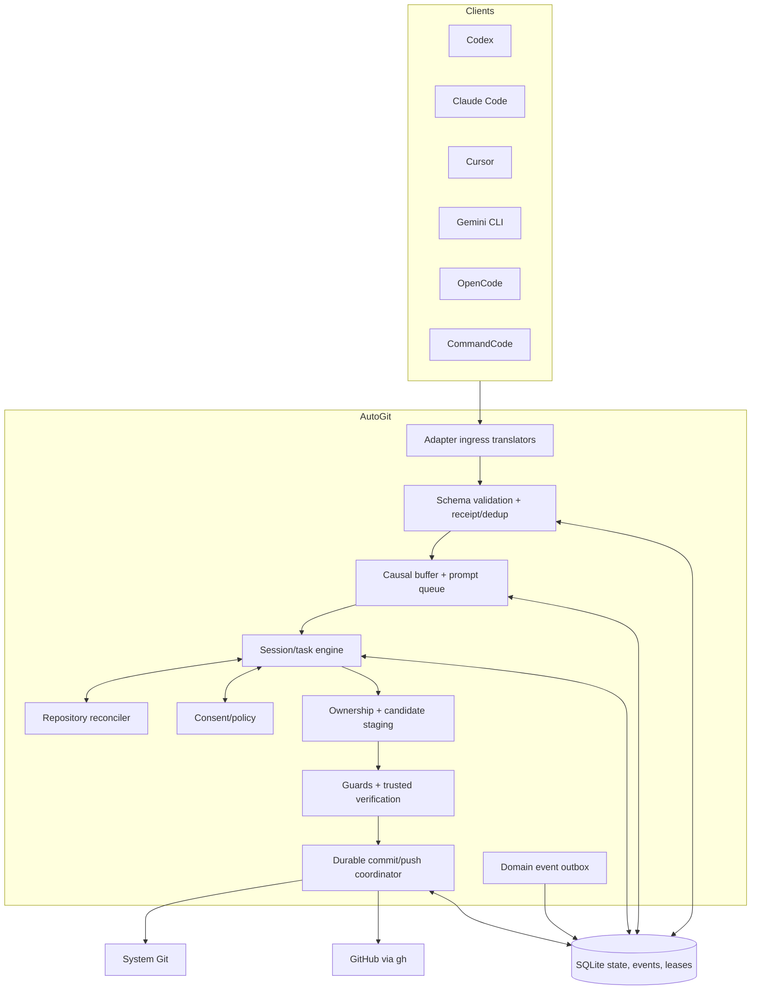
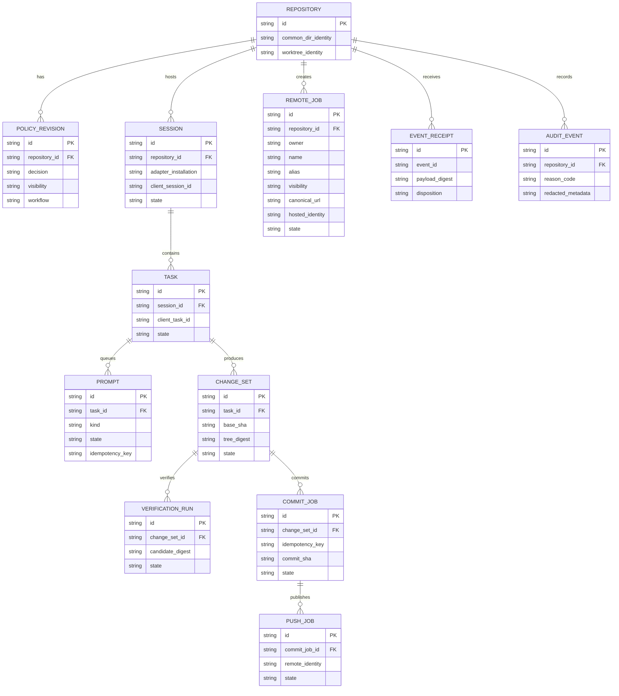

# AutoGit v1 architecture

Status: Proposed for Phase 0  
Contract: [`event-contract.md`](event-contract.md)  
Lifecycle: [`lifecycle.md`](lifecycle.md)  
Schema: [`../schemas/event-v1.schema.json`](../schemas/event-v1.schema.json)

## Requirements and constraints

AutoGit is a local-first executable for developer machines. It receives
at-least-once hook events from Codex, Claude Code, Cursor, Gemini CLI, OpenCode,
and CommandCode; coordinates concurrent sessions; and performs sensitive Git
and optional GitHub operations. Correctness, privacy, and crash recovery take
priority over service throughput. The expected Phase 0 scale is tens to
hundreds of repositories and several concurrent sessions per machine.

The existing Bash hooks establish these compatibility requirements: explicit
`.autogit` consent, private-by-default hosted repositories, `yes local` with no
network, read-only plan/print runs, repository-root resolution, generated-file
exclusion, safety guards, verification gates, local-commit preservation after a
push failure, and idempotent repeated idle events.

## Architecture

Use a Go modular monolith with hexagonal ports and adapters. Hook invocations
may be ephemeral; SQLite state, an outbox, a causal pending buffer, and durable
leases coordinate them. An optional daemon can reduce startup latency but must
use the same domain engine and event contract.

Adapters are reporters, not authorities. The core emits durable domain facts
only after independently inspecting Git and the result of a side effect.

## Module boundaries

| Module | Responsibility | Owns data | Exposes |
| --- | --- | --- | --- |
| Adapter | Client-specific hook parsing, response mapping, capabilities | Installation metadata | Ingress event port |
| Events | JSON Schema validation, canonical hashing, receipts, deduplication, causal buffering, quarantine | Event receipts and outbox | `AcceptEvent` |
| Repository | Canonical Git common-dir/worktree identity and read-only snapshots | Repository/worktree snapshots | `Inspect`, `Reconcile` |
| Policy | Consent, visibility, local-only/fast workflow, configuration precedence | Policy revisions | `Evaluate`, `RecordAnswer` |
| Session | Session/task state and completion evidence | Sessions, tasks | `ApplyIngress`, `CompletionCandidate` |
| Prompts | Durable prompt identity, leases, queue and answer state | Prompt records | `Enqueue`, `Answer`, `RequeueExpired` |
| Staging | Baselines, ownership, isolated candidate tree/index | ChangeSet revisions | `BuildCandidate` |
| Security | Path/content/size/conflict policy | Findings and bounded exceptions | `ScanCandidate` |
| Verification | Trusted command selection/execution and digest-bound evidence | Verification runs | `VerifyCandidate` |
| Commit | Conventional message validation and candidate/message binding | Commit jobs | `Compose`, `Create` |
| Provider | Remote identity, repository creation, ref inspection, push | Push jobs | `EnsureRemote`, `Push`, `InspectRef` |
| Coordinator | Writer leases, durable intents, retries, crash reconciliation | Job state and leases | `Run`, `Recover` |
| State | SQLite migrations, transactions, retention and secure storage | All durable projections | Typed repositories/unit-of-work |
| Operations | CLI, structured redacted logs, notifications | Diagnostic metadata | User/result surfaces |

Modules call typed interfaces, never each other's tables. Git and provider
operations are ports so disposable local repositories and fake remotes can
exercise recovery and idempotency.

## Durable data model

SQLite supplies local ACID transactions for receipts, state transitions, job
intents, leases, and retention. Repository policy remains reviewable in the
project/user configuration layer, while sensitive event details stay in the
permission-restricted application-data directory.

## Internal and CLI contracts

The adapter boundary is the versioned JSON contract in
[`event-contract.md`](event-contract.md). Ingress events and durable domain
events share an envelope but have different authority. Results use stable
dispositions/reason codes; client hook exit codes are adapter-specific.

The Phase 0 product has no network API. Planned CLI commands are:

| Command | Purpose |
| --- | --- |
| `autogit install` | Discover clients and install owned adapter entries |
| `autogit doctor` | Validate Git, `gh`, auth, adapters, DB, and locks |
| `autogit enable` / `disable` | Record or revoke project policy |
| `autogit init` | Consent-gated Git initialization with explicit branch and merged hygiene |
| `autogit status` | Show repository/session/change/commit/push state |
| `autogit plan` | Read-only preview of candidate, policy, checks, destination |
| `autogit hook` | Accept one adapter ingress event and return a result |
| `autogit verify` | Run configured verification against a candidate |
| `autogit sync` | Explicitly reconcile and progress a safe workflow |
| `autogit remote create` | Create and exactly bind an approved GitHub destination |
| `autogit retry` | Retry an eligible existing push/provider job |
| `autogit logs` | Show redacted audit records |
| `autogit uninstall` | Remove only AutoGit-owned integrations/state by option |

Mutating commands support dry-run where meaningful and structured JSON output.
Error shape is `{ "error": { "code": "...", "message": "..." } }`, with
stable machine-readable codes and noncontractual human text.

## Dependency and implementation policy

The current prototype depends on Bash, Git, `jq`, `gh`, and available project
test commands. Its one script currently couples parsing, consent, staging,
verification, Git, and GitHub operations. The Go v1 dependency policy is:

- standard library for process execution, JSON, hashing, paths, locks, and
  domain logic;
- one reviewed SQLite driver and one reviewed JSON Schema validator;
- no in-process Git implementation;
- no provider SDK until `gh` limitations justify one.

Commands use argument arrays, bounded output, explicit working directory, and
no shell. Dependencies receive CI license, vulnerability, and provenance
checks. Exact versions are a Phase 1 scaffold decision.

## Risks and mitigations

| Risk | Impact | Mitigation |
| --- | --- | --- |
| Shared Git index across sessions | Stale or mixed candidate commits | Isolated worktrees/indexes plus durable writer lease |
| Crash after Git/provider side effect | Duplicate commit/push | Intent-before-effect, exact SHA/ref reconciliation |
| Adapter lacks queue/task sequence | False completion/publication | Synthetic queue/task, settle window, conservative evidence |
| Pre-existing or overlapping files | Publishing another task's work | Baseline ownership and explicit conflict state |
| Secret/remote/path leakage | Privacy or security incident | HMAC identities, redaction, guards, bounded retention |
| Provider auth/non-fast-forward | Local/remote divergence | Preserve local commit, visible blocked push, no force push |
| Hook exit-code differences | Client misinterprets result | Structured result mapping per adapter |
| Current Bash commit failure exits zero | False success | Core postcondition check and explicit `commit.failed` domain fact |
