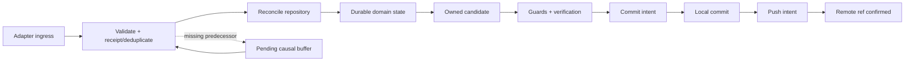

# AutoGit v1 deterministic lifecycle

Status: Proposed for Phase 0 acceptance  
Contract: [`event-contract.md`](event-contract.md)  
Schema: [`../schemas/event-v1.schema.json`](../schemas/event-v1.schema.json)

AutoGit persists separate repository, session, task, candidate change,
verification, commit, push, and prompt records. A model stop, an adapter claim,
or a successful local commit cannot be substituted for another state.

## Event processing

Adapters emit **ingress observations**. The core validates and deduplicates
them, reconciles the actual repository, and emits **durable domain facts**.
Only domain facts rebuild state or schedule side effects.



The receipt transaction stores the event ID, idempotency key, canonical digest,
and local receipt revision before it schedules work. Domain transitions and
outbox intents commit atomically with the corresponding state revision.

## State records

| Record | Stable identity | Key evidence |
| --- | --- | --- |
| Repository | Git common-dir + worktree identity | discovery, policy revision, remote identity |
| Session | repository + adapter installation + client instance/session | baseline HEAD/index/status, capability snapshot |
| Task | session + client task or synthetic turn ID | completion claims, prompt/tool evidence |
| Prompt | task + prompt kind + candidate/policy revision | durable queue state and answer |
| ChangeSet | task + candidate revision | base HEAD, tree/index digest, owned path digest |
| VerificationRun | candidate digest + policy/verifier revision | result, duration, bounded error/evidence digest |
| CommitJob | candidate digest + message digest | intent and commit SHA |
| PushJob | remote identity + ref + commit SHA | intent, attempts, confirmed remote SHA |

One module owns writes to each record. Other modules consume immutable
snapshots or typed ports.

## Repository and policy

```text
UNSEEN -> DISCOVERED -> CONSENT_PENDING
                         |           |
                         v           v
                  TRACKING_DISABLED  TRACKING_ENABLED
                                          |
                         local-only -----+----- remote needed
                                          |                 |
                                          v                 v
                                        READY       REMOTE_PENDING -> READY
```

Discovery is read-only. No marker plus a dirty project enters
`CONSENT_PENDING`; the same logical consent prompt is not emitted twice.
`yes`, `public`, `local`, and `fast` are policy facts, not adapter authority.
`TRACKING_ENABLED` permits local operation but does not imply a remote. Public
publication always requires explicit public consent.

## Session and task

```text
CREATED -> ACTIVE -> WAITING_PROMPT -> ACTIVE
             |          |
             |          +-----------> SETTLING
             v                         |
          CRASHED -> RECOVERING       v
             |                    COMPLETION_CANDIDATE
             +------------------------+ |       |
                                        |       +--> ACTIVE (new work)
                                        v
                                      ENDED
```

`FAILED`, `CANCELLED`, and `MODEL_STOPPED` are recorded outcomes/signals, not
automatic task completion. A `model.stopped` ingress event is weak evidence.
An ingress `task.completed` is a claim; a domain `task.completed` is emitted
only after the core has satisfied configured completion and delivery policy.

For adapters without task boundaries, create a synthetic task at
`prompt.submitted`. Completion candidacy requires a settle period, no active
tool, repository reconciliation, no sequence gap, and explicit sync or the
strongest available adapter end/idle evidence.

## Durable prompt queue

```text
REQUESTED -> QUEUED -> PRESENTED -> ANSWERED
                       |             |
                       +-----------> EXPIRED/CANCELLED
```

For `queue_state=native`, adapter queue facts are hints and are reconciled with
the client signal. For `queue_state=none`, the core synthesizes `queued` and
`presented`; unknown is never interpreted as empty. Prompt identity is
deterministic:

```text
HMAC(repo_id, worktree_id, task_id, prompt_kind, candidate_digest, policy_revision)
```

A model stop leaves an unanswered prompt queued. A queued blocking prompt keeps
the task active. A new prompt or relevant file event invalidates readiness
immediately. A prompt in an independent task cannot modify a committed change.

## Change and verification

```text
DETECTED -> RECONCILING -> OWNED -> STAGED -> VERIFY_PENDING -> VERIFIED
                 |           |                          |
                 v           v                          v
              AMBIGUOUS    BLOCKED                  INVALIDATED
```

Adapters report candidate paths only. The core derives a baseline/current Git
snapshot and excludes ambiguous pre-existing files. `STAGED` refers to an
AutoGit-owned candidate index/worktree; mutating the user's shared index is not
safe under concurrency.

```text
REQUESTED -> RUNNING -> PASSED
                    -> FAILED/CANCELLED
PASSED -- digest, policy, verifier, or guard change --> INVALIDATED
```

A pass is reusable only for the exact candidate tree/index digest, base commit,
verifier set/version, and policy revision. Any candidate or policy change
requires a fresh run.

## Commit and push

```text
COMMIT_REQUESTED -> QUEUED -> RUNNING -> CREATED
                                      -> FAILED
                                      -> RECONCILE_REQUIRED

PUSH_REQUESTED -> QUEUED -> RUNNING -> SUCCEEDED
                                    -> RETRY_WAIT
                                    -> BLOCKED
                                    -> SKIPPED_LOCAL
```

Before commit intent: consent, unambiguous ownership, safety guards, exact
candidate verification, valid message digest, unchanged HEAD/index, and the
repository writer lease are required. Intent is durable before invoking Git.
After a crash, compare parent/tree/message evidence; never repeat `git commit`
merely because a response was lost.

Push is identified by remote/ref/commit SHA and always targets an existing local
commit. Transient failures retry the same intent; authentication,
non-fast-forward, protection, collision, and safety failures become visible
`BLOCKED` states. Local-only policy emits `SKIPPED_LOCAL`. A push failure never
rolls back a local commit.

## Deterministic transition table

| Evidence | Transition/action | Publication |
| --- | --- | --- |
| No consent + changes | `CONSENT_PENDING`; enqueue one consent prompt | No |
| Declined policy | `TRACKING_DISABLED`; remain read-only | No |
| Active tool or blocking prompt | remain `ACTIVE/WAITING_PROMPT` | No |
| Model stopped only | enter/refresh `SETTLING` | No |
| Completion claim + changed tree | reconcile and invalidate old verification | No |
| Ambiguous ownership | exclude or request approval | No |
| Guard or verification failure | block/checkpoint with redacted reason | No |
| Digest or policy mismatch | invalidate and rerun verification | No |
| Concurrent HEAD/index change | release lease and reconcile | No |
| Commit succeeds + local-only | commit `CREATED`, push `SKIPPED_LOCAL` | Local only |
| Commit succeeds + transient push error | push `RETRY_WAIT` for same SHA | Not yet |
| Non-fast-forward/unsafe push | push `BLOCKED`; require user action | No |
| Remote ref confirms expected SHA | push `SUCCEEDED`, then domain task completion if otherwise eligible | Yes |

## Concurrency and recovery

Sessions may report concurrently, but Git mutations serialize by
`(repo_id, worktree_id, branch)` under a durable lease. Read-only verification
may run in parallel against immutable snapshots. A shared HEAD/index change
invalidates competing candidate evidence; last-writer-wins is forbidden.

On startup or stale-lease takeover, the reconciler re-resolves identity,
policy, HEAD/index/worktree, candidate digests, AutoGit refs, and exact remote
refs. It requeues expired prompts, emits `commit.reconciled` or
`push.succeeded` when evidence proves the side effect happened, and otherwise
retries only idempotent jobs. Unknown outcomes become visible
`RECONCILE_REQUIRED`, never an unverified duplicate operation.

Duplicate events are no-ops. Out-of-order events wait in a durable causal
buffer; replay follows causal references and local receipt revision, not wall
clock. A missing predecessor past its retention deadline is quarantined.

## Acceptance invariants

1. Invalid input causes no state, Git, or provider mutation.
2. Duplicate delivery cannot create a second prompt, commit, or push.
3. Same idempotency key with a different digest is quarantined.
4. No consent means no Git/provider mutation; public requires explicit public consent.
5. Verification names the exact immutable candidate digest.
6. Candidate, policy, HEAD, or index changes invalidate dependent evidence.
7. Commit and push are distinct facts; push always names an existing SHA.
8. Concurrent sessions cannot commit stale verification or shared-index state.
9. Crash recovery reconciles side effects before retrying them.
10. Model stop/session idle never implies task completion.
11. Plan/print modes are read-only and local-only never contacts a remote.
12. Events/logs contain no prompt, source, diff, token, credential, or secret.
