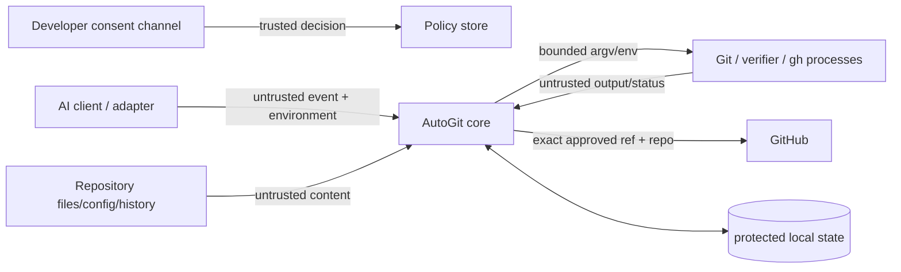

# AutoGit v1 threat model

Status: Draft for Phase 0 acceptance  
Method: STRIDE-informed local developer-tool assessment

## 1. Security objective

AutoGit runs with a developer's filesystem, Git, credential, and GitHub access.
Its primary security objective is to ensure that untrusted agent events and
repository content cannot expand a narrowly consented action into reading,
executing, committing, or publishing other data.

The installed Bash prototype is not the v1 security boundary. During Phase 0,
two critical prototype defects were reproduced and contained with regression
tests:

- `yes local` pushed when an existing `origin` was configured;
- an option-looking current branch could cause Git to push unrelated branches.

The remaining findings below become v1 requirements and release gates. They
must not be addressed by continuing to add implicit trust to the Bash hook.

## 2. Assets

- Source, untracked files, index contents, history, branches, tags, worktrees,
  submodules, and files outside the project.
- User consent, effective policy, verification evidence, and audit integrity.
- GitHub/SSH/cloud credentials and inherited environment secrets.
- Repository owner/name/visibility/remote identity and protected branches.
- Commit authorship, signing configuration, and history provenance.
- Privacy of prompts, source, diffs, paths, remotes, and commit-message evidence.
- Developer-machine availability: processes, CPU, memory, disk, Git locks, and
  network quota.

## 3. Trust boundaries

1. **AI client to core:** stdin, environment, cwd, session/task IDs, paths, and
   completion claims can be malformed, forged, replayed, or prompt-injected.
2. **Repository to core/processes:** config, attributes, hooks, symlinks,
   filenames, tests, build tools, history, and working files can be hostile.
3. **Core to executables:** `PATH` resolution, executable replacement, inherited
   variables, credential helpers, Git hooks/filters, and subprocess output can
   alter intended behavior.
4. **Core to provider:** credentials and source cross the machine boundary;
   successful command exit does not prove repository identity or remote state.
5. **Local state:** policy/DB/config permissions, tampering, rollback, corruption,
   concurrency, and stale leases can invalidate decisions.

## 4. Threat register

| ID | Category | Threat | Impact | Likelihood | Required mitigation |
| --- | --- | --- | --- | --- | --- |
| TM-001 | Spoofing/Elevation | Model or prompt-injected content writes `yes public`/weak policy. | Critical | High | Consent through AutoGit UI/CLI bound to canonical repo; public requires direct human confirmation; state outside model-writable files. |
| TM-002 | Spoofing | Forged adapter/session/task/completion event. | High | Medium | Owned adapter installation identity, schema/capability manifest, event IDs, cross-check with Git/filesystem, completion never authoritative alone. |
| TM-003 | Tampering | Target/cwd/environment resolves a different repo or symlink escape. | Critical | Medium | Canonicalize with platform APIs, approved-root policy, owner/permission checks, reject root/home/protected roots and replacement races. |
| TM-004 | Tampering | Marker/gate/generated file is a symlink or swapped after validation. | High | Medium | Keep policy/evidence outside repo; no-follow atomic file APIs; file identity and content digests; isolated candidate tree. |
| TM-005 | Tampering/Elevation | Whole-worktree staging includes unrelated or concurrent work. | Critical | High | Baseline/session ownership, isolated candidate index, path-level evidence, one writer lease, ambiguity blocks. |
| TM-006 | Tampering | mtime/late event/TOCTOU makes verification stale. | High | High | Bind scans/tests/message to immutable tree and policy digests; recheck HEAD/index/lease immediately before commit. |
| TM-007 | Elevation | Filename, branch, ref, message, or repo name becomes CLI option/shell input. | Critical | Medium | Never use a shell; argv arrays; explicit `--`; validated refs; explicit `HEAD:refs/heads/...`; bounded Unicode/control-character policy. |
| TM-008 | Elevation | Repository Git hooks, clean/smudge filters, fsmonitor, credential helpers, or config execute code. | Critical | Medium | Inspect effective Git config; run only approved hooks/filters or use controlled Git config/hooks path; document signing/credential trust separately. |
| TM-009 | Elevation/Disclosure | `npm test`, Cargo build scripts, Go tests, or other verifier exfiltrates credentials/source. | Critical | High | Verification commands require user/trusted policy; scrub secrets/environment; no network by default where sandbox available; resource/time/output limits; visible opt-in for unsandboxed execution. |
| TM-010 | Disclosure | Current-diff scanner misses secret in binary, encoding, ignored file, LFS object, submodule, or existing history. | Critical | Medium | Layered scanner; scan exact candidate blobs; full reachable history before first publication; provider push protection; fail closed on scanner error. |
| TM-011 | Disclosure | Public/private or remote destination differs from consent. | Critical | Medium | Exact provider/host/owner/repo/visibility identity stored and revalidated before each first/sensitive push; show destination; postcondition API check. |
| TM-012 | Tampering | Repository-name collision attaches unrelated existing remote. | Critical | Medium | Never fallback-attach; create transaction with returned canonical identity; collision blocks or uses approved alternative. |
| TM-013 | Tampering/Elevation | Git push config/refspec pushes tags, all refs, deletes, or forces. | Critical | Medium | Ignore implicit push refspec for automated jobs; exact source SHA/destination ref; deny force/delete/all/mirror/tags; verify remote ref postcondition. |
| TM-014 | Repudiation | Commit/push/verification failure is returned as success. | High | High | Typed outcome codes, persist intent/result, nonzero/deferred adapter mapping, visible status and notification; never discard stderr classification. |
| TM-015 | Repudiation | Commit message invents author/signature/issue closure/provenance. | Medium | High | Strict message schema; trailer allowlist/denylist case-insensitive; user Git identity authoritative; explicit signing policy. |
| TM-016 | Denial of service | Unbounded hook input, subprocess, output, scanner, test, lock, or retry. | High | High | Input/output limits, context cancellation, process-tree termination, resource bounds, lease expiry, retry budget/backoff/circuit breaker. |
| TM-017 | Tampering | Duplicate/out-of-order event or crash duplicates commit/repo/push. | High | High | Durable event receipt, payload digest, idempotency key, persisted intent-before-effect, Git/provider reconciliation. |
| TM-018 | Tampering | Concurrent sessions race on shared index/HEAD/remote. | High | High | Canonical per-repo/worktree writer lock, isolated candidates, expected-state compare-and-swap, overlap blocks. |
| TM-019 | Disclosure | Logs/DB/telemetry store prompts, source, secret values, remotes, or personal paths. | High | Medium | Data minimization, redaction at source, structured allowlisted fields, restrictive permissions, retention, telemetry opt-in. |
| TM-020 | Spoofing | Malicious/replaced `git`, `gh`, or verifier is found through `PATH`. | Critical | Medium | Resolve and record trusted executable identity during install/doctor; revalidate changes; controlled PATH; verify release/install provenance. |
| TM-021 | Tampering | Local DB/config is modified or rolled back. | High | Medium | Restrictive permissions, schema/integrity checks, atomic migrations/backups, policy revision/audit chain, fail closed on corruption. |
| TM-022 | Disclosure/Elevation | GitHub publication triggers hostile CI or third-party automation. | High | Medium | Display remote workflow risk, least-privilege token, safe branch mode, no secrets in verification environment, provider permissions review. |
| TM-023 | Tampering | Oversize guard reads worktree size instead of staged blob or fails cross-platform. | High | Medium | Inspect candidate Git blob/object sizes with portable APIs; scanner error blocks. |
| TM-024 | Disclosure | Local-only mode contacts provider through status/auth/push or existing remote. | Critical | High | Enforce network-denied policy before provider resolution; integration test with existing remotes and network observer. |

## 5. Abuse and misuse cases

- A project README instructs an agent to enable public fast publication.
- An adapter sends an attacker-controlled directory or malformed JSON so the
  hook falls back to a sensitive current directory.
- A symlinked policy, message, ignore, or temporary file points outside the repo.
- A branch is named `--all`, or Git push config contains force/mirror refspecs.
- `origin` is changed between consent and push or points to an unexpected host.
- A same-name GitHub repository already exists under the authenticated account.
- A test/build script uploads `GH_TOKEN`, SSH material, cloud credentials, or
  source; a Git hook/filter performs the same action during add/commit.
- A secret exists in an older commit and a clean existing repository is newly
  published without history scanning.
- Two agents change the same path and both receive idle/stop events.
- AutoGit crashes after Git/provider success but before recording success.
- A malicious path contains newlines/control sequences to forge diagnostics.
- A fake binary earlier in `PATH` reports success or steals credentials.

## 6. Non-negotiable safety invariants

1. No operation outside a canonical, approved repository/worktree.
2. No Git mutation before authenticated tracking consent.
3. Local-only causes zero provider/network operation even when remotes exist.
4. Public publication requires separate direct human consent and verified
   destination visibility.
5. Only owned/approved paths enter the candidate; user index/worktree state is
   never discarded.
6. No force, mirror, delete, all-ref, implicit-refspec, or automatic history
   rewrite operation.
7. Push only an exact existing commit SHA to an exact approved destination ref.
8. Content, tree, base, policy, or repository-state change invalidates dependent
   security/verification evidence.
9. Existing remote and history are scanned/verified before first publication.
10. Scanner, verifier, Git, provider, validation, timeout, and reconciliation
    errors cannot be converted into publishable success.
11. No raw secret, prompt, source/diff, credential, or untrusted control
    character enters default logs or telemetry.
12. AutoGit never deletes repositories/refs or removes user data automatically.

There is no `fast` exception to these invariants.

## 7. Secure defaults

- Private, safe-branch mode; local checkpoint on uncertainty.
- Consent stored outside the repository and inspectable with `config explain`.
- No network in local mode or trusted local verification by default.
- No arbitrary repository command execution without explicit policy.
- Exact provider destination allowlist and postcondition verification.
- Isolated candidate tree plus per-repository writer lease.
- Full history scan before a repository's first remote publication.
- Fixed/bounded input, output, execution time, resources, and retry counts.
- AutoGit-controlled Git hook/filter execution policy.
- Redacted local audit logs, restrictive state permissions, telemetry off.
- Invalid/unsupported client payload means no mutation and visible degradation.

## 8. Security acceptance tests

At minimum, v1 must exercise real disposable repositories for:

- local-only with existing remote and a network observer;
- branch/ref names resembling every relevant Git push option;
- force/mirror/delete/tag/all-ref push config and unusual upstreams;
- remote host/owner/name/visibility changes and same-name collisions;
- malformed/oversized/replayed/out-of-order hook payloads;
- target, marker, gate, ignore, README, index, and candidate symlink races;
- path traversal, nested repos, worktrees, submodules, Unicode/control paths;
- concurrent sessions and process termination at every persisted intent point;
- changed content/index/HEAD/policy after scan or verification;
- secrets in text, binary, encoded data, LFS, submodules, and prior history;
- repository hooks/filters/fsmonitor and malicious verification commands;
- credential/environment scrubbing, network isolation, timeout, and process-tree
  termination on Linux, macOS, and Windows;
- fake/replaced executables and changed PATH/config after installation;
- commit/GitHub false success, partial creation, auth loss, push protection,
  protected branches, non-fast-forward, and postcondition mismatch;
- redaction of secrets, remotes, paths, control characters, and subprocess output.

No live user repository is used by these tests. Provider tests use an isolated
test account/organization and uniquely named disposable repositories with a
cleanup allowlist and explicit ownership tags.

## 9. Residual risk and user responsibility

Secret scanners and tests cannot prove source is safe or correct. AutoGit must
state this clearly and make evidence inspectable. Public publication remains a
developer decision. Any mode that executes repository code inherits some risk;
where strong OS sandboxing is unavailable, AutoGit must disclose the limitation
and require an explicit trusted-project policy rather than claiming isolation.

